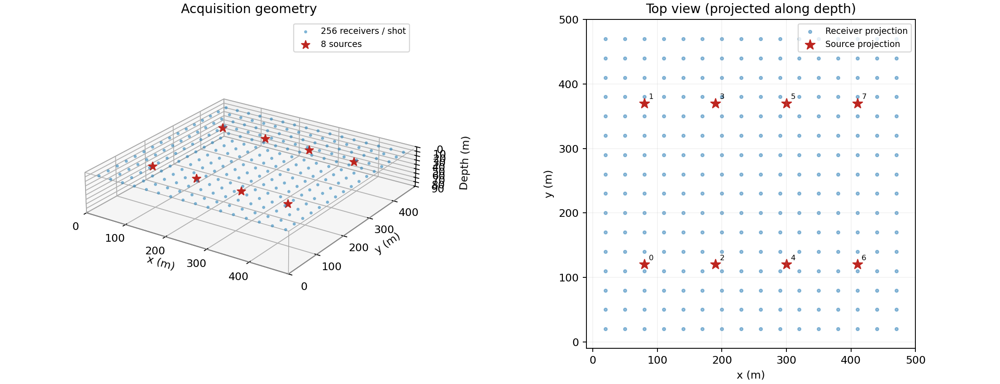
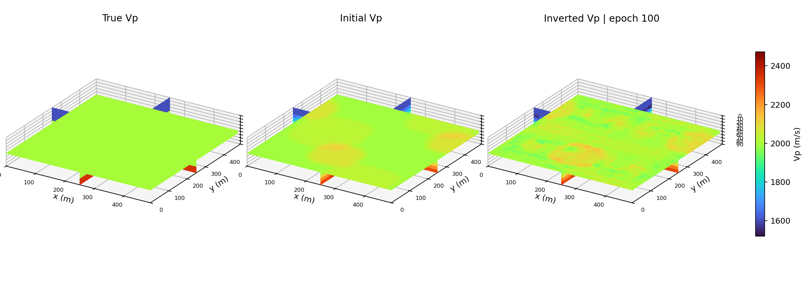
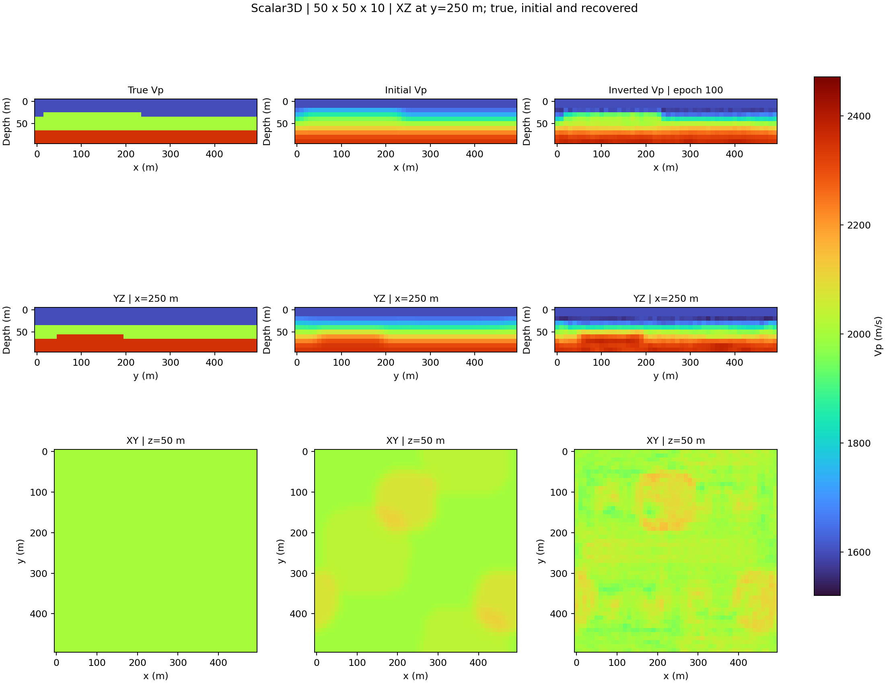
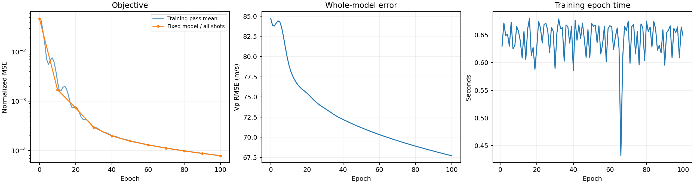
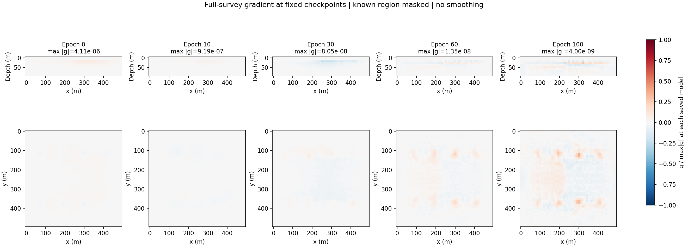
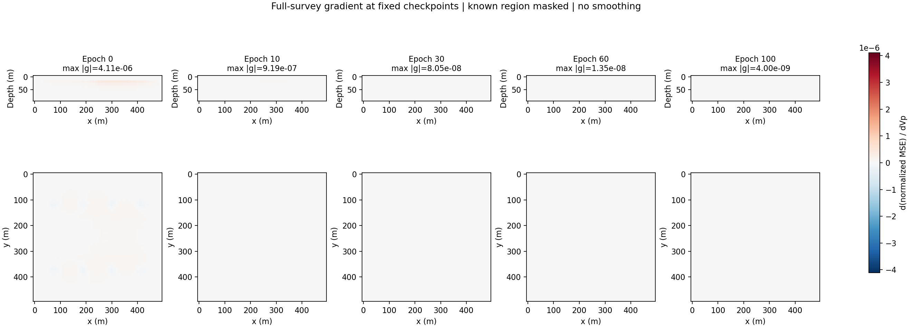
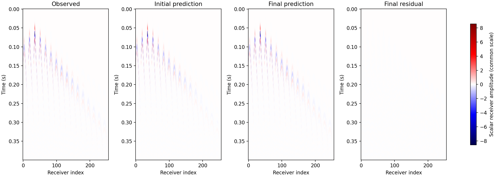

# 起伏薄层模型

这是只有 10 个深度网格的轻量三维辅助算例。100 轮后全模型 RMSE 降低约 20%，适合展示层状模型、Gaussian 初值与梯度演化，不应标为高精度重建。

本页展示 2026-10-08 保存的真实 CUDA 运行结果。通用参数、目标函数和验证范围见 [Scalar3D 总览](index.md)。

## 实验设置

| 参数 | 实测配置 / 结果 |
|---|---|
| 网格 (X × Y × Z) | 50 × 50 × 10 |
| 炮数 / 每炮接收点 | 8 / 256 |
| dx / dt / nt | 10 m / 0.001 s / 400 |
| Ricker / accuracy / PML / buffer | 25 Hz / 4 / 12 / 5 |
| memory / step_ratio | boundary / 1 |
| Adam lr / epochs | 10.0 / 100 |
| 训练时间 | 77.10 s |
| 全模型 RMSE (m/s) | 84.704 → 67.714 |
| 固定模型目标降幅 | 99.8340% |

## 采集几何

八个震源与每炮 256 个接收点位于这个薄层三维区域内，具体位置见采集图。图中纵向尺度明显小于两个水平方向；这个物理长宽比在模型和切片图中保持不变。全部边界使用 PML。

```{raw} html
<figure class="sw-example-figure" id="figure-acquisition">
  <div class="sw-example-viewport" role="region" tabindex="0" aria-label="可横向滚动的科学图像">
    <a href="../_static/scalar3d/layered/acquisition.png" target="_blank" rel="noopener" aria-label="打开原始分辨率图像"></a>
  </div>
  <figcaption>三维采集几何与沿深度投影的顶视图；红色星号为震源，蓝点为接收点。坐标单位为米。 <a href="../_static/scalar3d/layered/acquisition.png" target="_blank" rel="noopener">打开原始分辨率图像 ↗</a></figcaption>
</figure>
```

## 真实、初始与反演模型

三层速度分别为 1600、2000、2350 m/s，两处界面随 x、y 起伏。初始模型由真值做 Gaussian 平滑得到，sigma 按保存数组 (Z, Y, X) 顺序为 (1.35, 1, 1)。因此，这个初值利用了合成真值，不能把它当作未知真实地质模型的通用初值构建方法。

```{raw} html
<figure class="sw-example-figure" id="figure-model-3d">
  <div class="sw-example-viewport" role="region" tabindex="0" aria-label="可横向滚动的科学图像">
    <a href="../_static/scalar3d/layered/model_3d.png" target="_blank" rel="noopener" aria-label="打开原始分辨率图像"></a>
  </div>
  <figcaption>真实、初始和最终 Vp 的三正交切面拼接，使用共同速度色标（m/s）。这是三维体的切面展示，并非完整体积渲染；最终模型未平滑。 <a href="../_static/scalar3d/layered/model_3d.png" target="_blank" rel="noopener">打开原始分辨率图像 ↗</a></figcaption>
</figure>
```

```{raw} html
<figure class="sw-example-figure" id="figure-model-comparison">
  <div class="sw-example-viewport" role="region" tabindex="0" aria-label="可横向滚动的科学图像">
    <a href="../_static/scalar3d/layered/model_comparison.png" target="_blank" rel="noopener" aria-label="打开原始分辨率图像"></a>
  </div>
  <figcaption>同一三维模型的三个方向切片，逐列比较真值、初值和最终结果。米制长宽比与速度色标保持一致，避免几何拉伸掩盖恢复误差。 <a href="../_static/scalar3d/layered/model_comparison.png" target="_blank" rel="noopener">打开原始分辨率图像 ↗</a></figcaption>
</figure>
```

## 优化与收敛

固定顶部两个深度网格面（z=0、1），其他体素独立优化；Vp 约束为 1400–2600 m/s。每轮两个四炮 batch。较低的波形失配并不意味着所有界面和层速度均已正确恢复；应联合查看薄层切片与 RMSE。

```{raw} html
<figure class="sw-example-figure" id="figure-convergence">
  <div class="sw-example-viewport" role="region" tabindex="0" aria-label="可横向滚动的科学图像">
    <a href="../_static/scalar3d/layered/convergence.png" target="_blank" rel="noopener" aria-label="打开原始分辨率图像"></a>
  </div>
  <figcaption>训练 pass 平均与固定模型全炮目标分开记录。RMSE 使用合成真值计算；它是评估指标，没有作为优化目标。训练 pass 内模型逐步更新，因此两条目标曲线不必完全重合。 <a href="../_static/scalar3d/layered/convergence.png" target="_blank" rel="noopener">打开原始分辨率图像 ↗</a></figcaption>
</figure>
```

## 中间模型的梯度

展示的 checkpoint 为 epoch 0, 10, 30, 60, 100。每张图来自保存模型上的全炮梯度重算，不是训练某个 batch 的即时梯度。原始梯度与 mask 后梯度分别保存，重算 loss 与原固定模型评估对应；这一后处理的耗时不含在训练时间内。

```{raw} html
<figure class="sw-example-figure" id="figure-gradients-normalized">
  <div class="sw-example-viewport" role="region" tabindex="0" aria-label="可横向滚动的科学图像">
    <a href="../_static/scalar3d/layered/gradients_normalized.png" target="_blank" rel="noopener" aria-label="打开原始分辨率图像"></a>
  </div>
  <figcaption>保存模型上重新累加的全炮 dJ/dVp，应用已知区域 mask，未做预条件化或平滑。每个梯度分别除以其全体积 max|g|，标题保留原始最大幅值；颜色只能比较形态，不能比较绝对大小。 <a href="../_static/scalar3d/layered/gradients_normalized.png" target="_blank" rel="noopener">打开原始分辨率图像 ↗</a></figcaption>
</figure>
```

```{raw} html
<figure class="sw-example-figure" id="figure-gradients-shared-scale">
  <div class="sw-example-viewport" role="region" tabindex="0" aria-label="可横向滚动的科学图像">
    <a href="../_static/scalar3d/layered/gradients_shared_scale.png" target="_blank" rel="noopener" aria-label="打开原始分辨率图像"></a>
  </div>
  <figcaption>同一组 checkpoint 梯度使用共同原始色标，可以比较绝对幅值。后期梯度较小而在图上变淡是量级变化，不表示数组被丢弃或另做归一化。 <a href="../_static/scalar3d/layered/gradients_shared_scale.png" target="_blank" rel="noopener">打开原始分辨率图像 ↗</a></figcaption>
</figure>
```

## 炮集与残差

```{raw} html
<figure class="sw-example-figure" id="figure-shot-gather">
  <div class="sw-example-viewport" role="region" tabindex="0" aria-label="可横向滚动的科学图像">
    <a href="../_static/scalar3d/layered/shot_gather.png" target="_blank" rel="noopener" aria-label="打开原始分辨率图像"></a>
  </div>
  <figcaption>第 0 炮观测、初始预测、最终预测与最终残差，使用同一振幅色标。横轴是接收点索引，纵轴为时间；道集相似程度应与模型误差一起判断。 <a href="../_static/scalar3d/layered/shot_gather.png" target="_blank" rel="noopener">打开原始分辨率图像 ↗</a></figcaption>
</figure>
```

## 数值检查

以下为报告记录的相对 L2 误差；所有列出的检查均在预设阈值内。方向导数只覆盖一个内部方向，不覆盖填充边缘参数的导数或任意配置。

| 检查 | 空间阶数 | 记录误差 | 梯度 / 导数误差 |
|---|---:|---:|---:|
| full / boundary | 2 | 0 | 5.534903087e-07 |
| full / boundary | 4 | 0 | 7.268850089e-07 |
| full / boundary | 6 | 0 | 5.628268241e-07 |
| full / boundary | 8 | 0 | 4.354951216e-07 |
| 中心有限差分 / 梯度内积 | 4 | — | 9.924772394e-05 |
| 单卡 / 四卡 | 4 | 0 | 4.541373676e-08 |

阈值与计算口径见{ref}`验证范围 <validation-scope>`。

## 下载与复现

进入[下载与复现](reproduce.md)获取完整报告、Notebook、脚本和数值结果说明。每幅图都可点击查看原始分辨率；网页没有重新绘制或美化反演结果。
