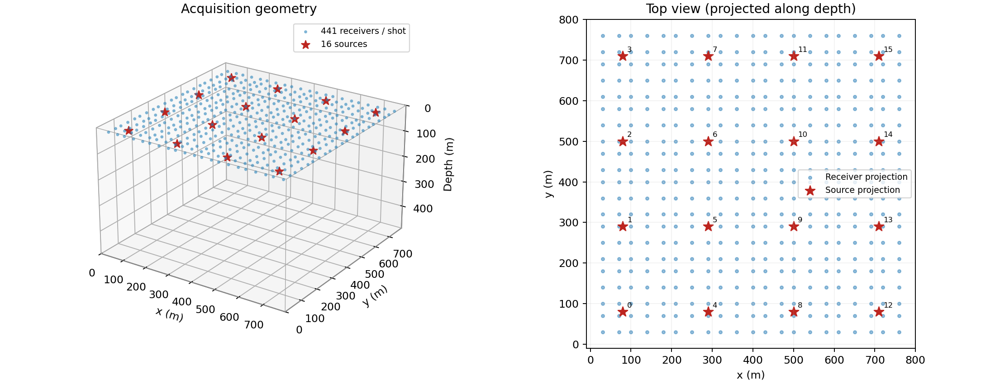
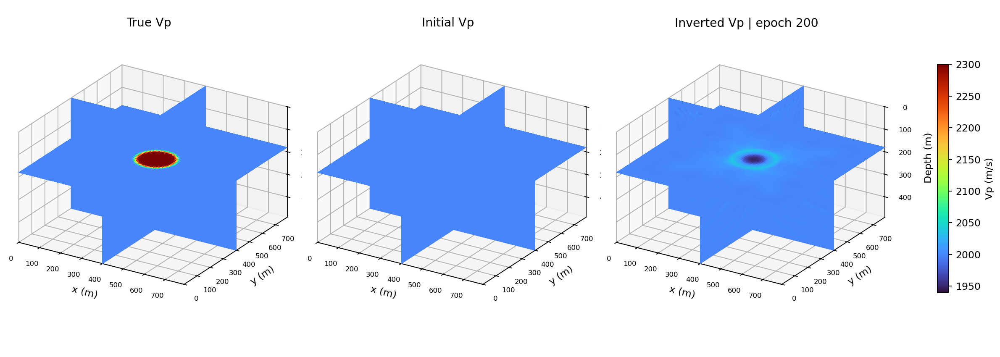
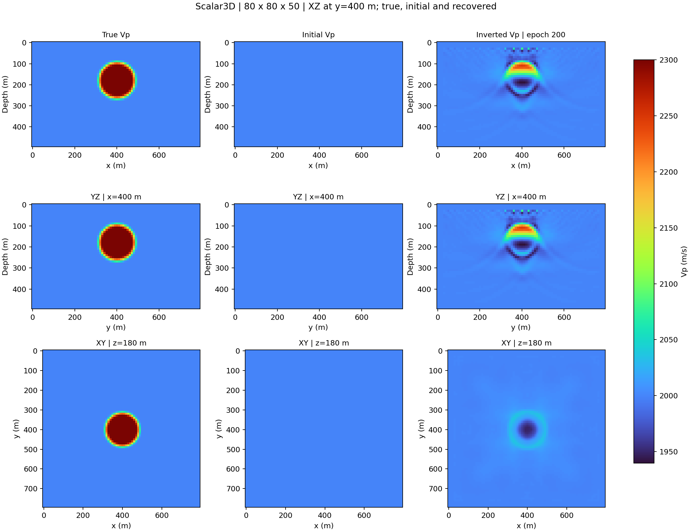
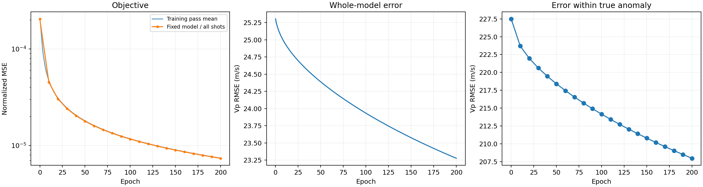
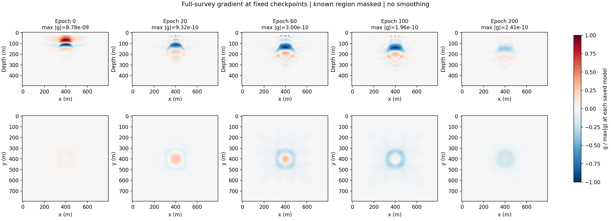
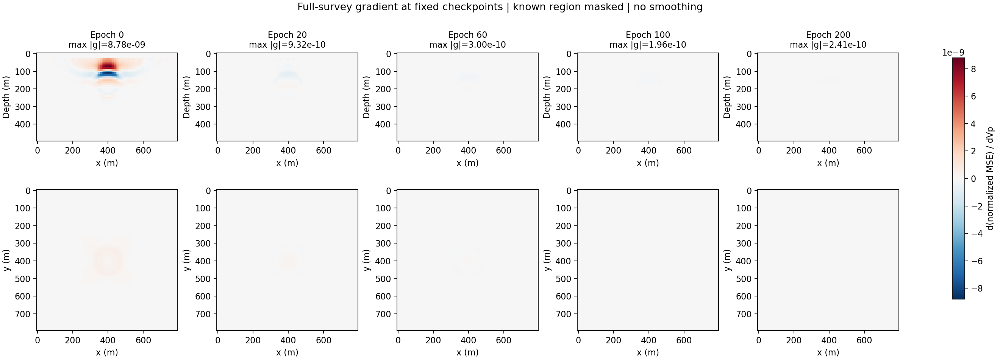
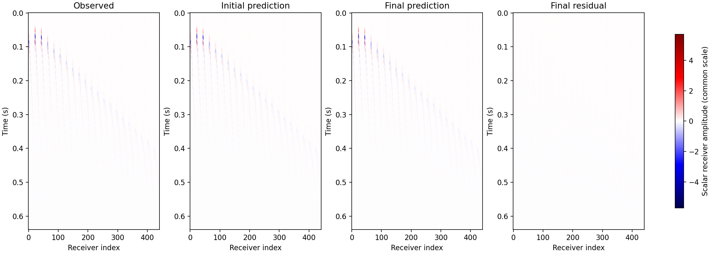

# 地表采集异常体

数值一致性检查通过，但异常体内部速度恢复不足。这个三维对照算例保留失败程度和真实指标，用于说明 loss 大幅下降与完整模型恢复是两个不同结论。

本页展示 2026-10-08 保存的真实 CUDA 运行结果。通用参数、目标函数和验证范围见 [Scalar3D 总览](index.md)。

## 实验设置

| 参数 | 实测配置 / 结果 |
|---|---|
| 网格 (X × Y × Z) | 80 × 80 × 50 |
| 炮数 / 每炮接收点 | 16 / 441 |
| dx / dt / nt | 10 m / 0.001 s / 640 |
| Ricker / accuracy / PML / buffer | 25 Hz / 4 / 12 / 5 |
| memory / step_ratio | boundary / 1 |
| Adam lr / epochs | 10.0 / 200 |
| 训练时间 | 707.66 s |
| 全模型 RMSE (m/s) | 25.305 → 23.276 |
| 固定模型目标降幅 | 96.4050% |

## 采集几何

16 炮组成 4 × 4 网格，441 个检波点组成 21 × 21 网格，均位于模型内深度 20 m。没有侧面或底部传感器。所有边界均使用 PML；顶部平面采集不表示设置了压力释放自由表面。

```{raw} html
<figure class="sw-example-figure" id="figure-acquisition">
  <div class="sw-example-viewport" role="region" tabindex="0" aria-label="可横向滚动的科学图像">
    <a href="../_static/scalar3d/surface/acquisition.png" target="_blank" rel="noopener" aria-label="打开原始分辨率图像"></a>
  </div>
  <figcaption>三维采集几何与沿深度投影的顶视图；红色星号为震源，蓝点为接收点。坐标单位为米。 <a href="../_static/scalar3d/surface/acquisition.png" target="_blank" rel="noopener">打开原始分辨率图像 ↗</a></figcaption>
</figure>
```

## 真实、初始与反演模型

背景与初值均为 2000 m/s。异常体中心为 (400, 400, 180) m，核心半径 70 m，余弦过渡至 100 m。真实中心速度 2300 m/s，而最终中心为 1948.37 m/s。异常体区域 RMSE 仅从 227.50 降至 207.96 m/s。主要恢复的是散射界面，内部正速度对比度没有正确恢复。

```{raw} html
<figure class="sw-example-figure" id="figure-model-3d">
  <div class="sw-example-viewport" role="region" tabindex="0" aria-label="可横向滚动的科学图像">
    <a href="../_static/scalar3d/surface/model_3d.png" target="_blank" rel="noopener" aria-label="打开原始分辨率图像"></a>
  </div>
  <figcaption>真实、初始和最终 Vp 的三正交切面拼接，使用共同速度色标（m/s）。这是三维体的切面展示，并非完整体积渲染；最终模型未平滑。 <a href="../_static/scalar3d/surface/model_3d.png" target="_blank" rel="noopener">打开原始分辨率图像 ↗</a></figcaption>
</figure>
```

```{raw} html
<figure class="sw-example-figure" id="figure-model-comparison">
  <div class="sw-example-viewport" role="region" tabindex="0" aria-label="可横向滚动的科学图像">
    <a href="../_static/scalar3d/surface/model_comparison.png" target="_blank" rel="noopener" aria-label="打开原始分辨率图像"></a>
  </div>
  <figcaption>同一三维模型的三个方向切片，逐列比较真值、初值和最终结果。米制长宽比与速度色标保持一致，避免几何拉伸掩盖恢复误差。 <a href="../_static/scalar3d/surface/model_comparison.png" target="_blank" rel="noopener">打开原始分辨率图像 ↗</a></figcaption>
</figure>
```

## 优化与收敛

外侧三个网格面厚的已知背景固定，内部体素独立优化，Vp 约束为 1700–2500 m/s；没有球心或形状约束，也没有梯度或结果平滑。每轮四个四炮 batch。有限照明、25 Hz 频带和均匀初值是可能原因，但没有独立对照实验确定各项贡献。

```{raw} html
<figure class="sw-example-figure" id="figure-convergence">
  <div class="sw-example-viewport" role="region" tabindex="0" aria-label="可横向滚动的科学图像">
    <a href="../_static/scalar3d/surface/convergence.png" target="_blank" rel="noopener" aria-label="打开原始分辨率图像"></a>
  </div>
  <figcaption>训练 pass 平均与固定模型全炮目标分开记录。RMSE 使用合成真值计算；它是评估指标，没有作为优化目标。训练 pass 内模型逐步更新，因此两条目标曲线不必完全重合。 <a href="../_static/scalar3d/surface/convergence.png" target="_blank" rel="noopener">打开原始分辨率图像 ↗</a></figcaption>
</figure>
```

## 中间模型的梯度

展示的 checkpoint 为 epoch 0, 20, 60, 100, 200。每张图来自保存模型上的全炮梯度重算，不是训练某个 batch 的即时梯度。原始梯度与 mask 后梯度分别保存，重算 loss 与原固定模型评估对应；这一后处理的耗时不含在训练时间内。

```{raw} html
<figure class="sw-example-figure" id="figure-gradients-normalized">
  <div class="sw-example-viewport" role="region" tabindex="0" aria-label="可横向滚动的科学图像">
    <a href="../_static/scalar3d/surface/gradients_normalized.png" target="_blank" rel="noopener" aria-label="打开原始分辨率图像"></a>
  </div>
  <figcaption>保存模型上重新累加的全炮 dJ/dVp，应用已知区域 mask，未做预条件化或平滑。每个梯度分别除以其全体积 max|g|，标题保留原始最大幅值；颜色只能比较形态，不能比较绝对大小。 <a href="../_static/scalar3d/surface/gradients_normalized.png" target="_blank" rel="noopener">打开原始分辨率图像 ↗</a></figcaption>
</figure>
```

```{raw} html
<figure class="sw-example-figure" id="figure-gradients-shared-scale">
  <div class="sw-example-viewport" role="region" tabindex="0" aria-label="可横向滚动的科学图像">
    <a href="../_static/scalar3d/surface/gradients_shared_scale.png" target="_blank" rel="noopener" aria-label="打开原始分辨率图像"></a>
  </div>
  <figcaption>同一组 checkpoint 梯度使用共同原始色标，可以比较绝对幅值。后期梯度较小而在图上变淡是量级变化，不表示数组被丢弃或另做归一化。 <a href="../_static/scalar3d/surface/gradients_shared_scale.png" target="_blank" rel="noopener">打开原始分辨率图像 ↗</a></figcaption>
</figure>
```

## 炮集与残差

```{raw} html
<figure class="sw-example-figure" id="figure-shot-gather">
  <div class="sw-example-viewport" role="region" tabindex="0" aria-label="可横向滚动的科学图像">
    <a href="../_static/scalar3d/surface/shot_gather.png" target="_blank" rel="noopener" aria-label="打开原始分辨率图像"></a>
  </div>
  <figcaption>第 0 炮观测、初始预测、最终预测与最终残差，使用同一振幅色标。横轴是接收点索引，纵轴为时间；道集相似程度应与模型误差一起判断。 <a href="../_static/scalar3d/surface/shot_gather.png" target="_blank" rel="noopener">打开原始分辨率图像 ↗</a></figcaption>
</figure>
```

## 数值检查

以下为报告记录的相对 L2 误差；所有列出的检查均在预设阈值内。方向导数只覆盖一个内部方向，不覆盖填充边缘参数的导数或任意配置。

| 检查 | 空间阶数 | 记录误差 | 梯度 / 导数误差 |
|---|---:|---:|---:|
| full / boundary | 2 | 0 | 5.542873980e-07 |
| full / boundary | 4 | 0 | 6.898225014e-07 |
| full / boundary | 6 | 0 | 6.311192622e-07 |
| full / boundary | 8 | 0 | 6.078466607e-07 |
| 中心有限差分 / 梯度内积 | 4 | — | 7.054908057e-05 |
| 单卡 / 四卡 | 4 | 0 | 5.777887630e-08 |

阈值与计算口径见{ref}`验证范围 <validation-scope>`。

## 下载与复现

进入[下载与复现](reproduce.md)获取完整报告、Notebook、脚本和数值结果说明。每幅图都可点击查看原始分辨率；网页没有重新绘制或美化反演结果。
