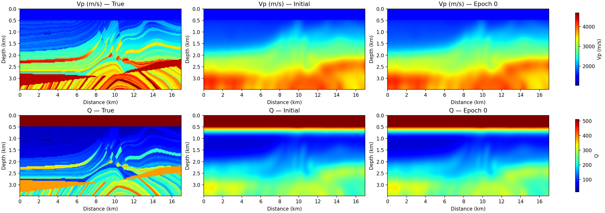
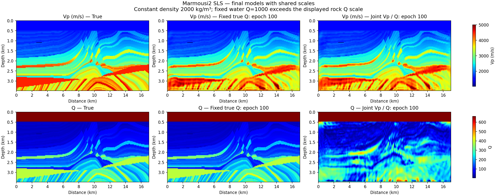
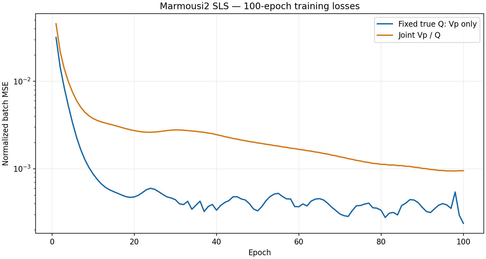
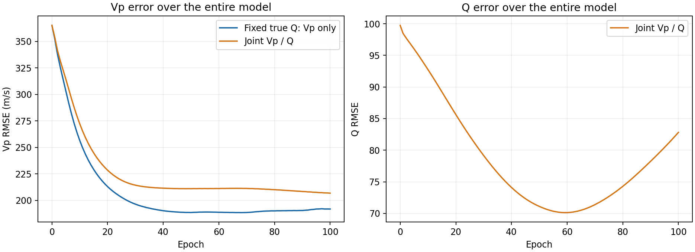
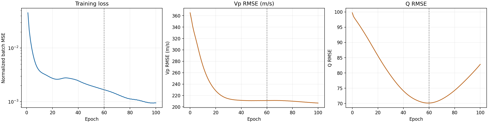
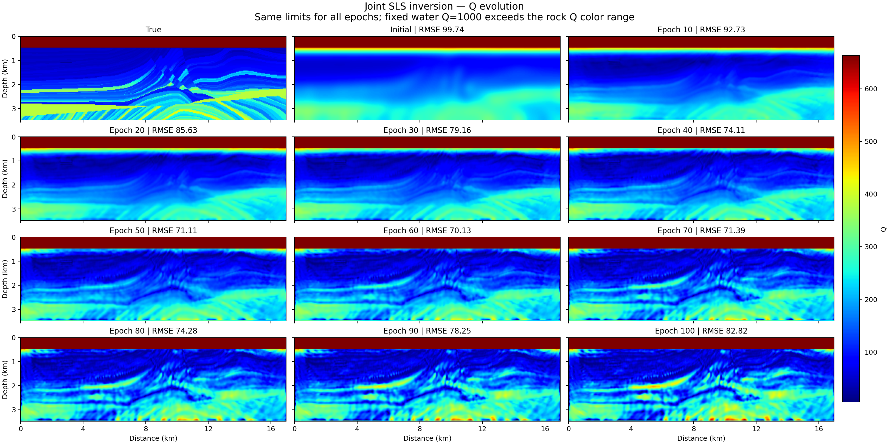
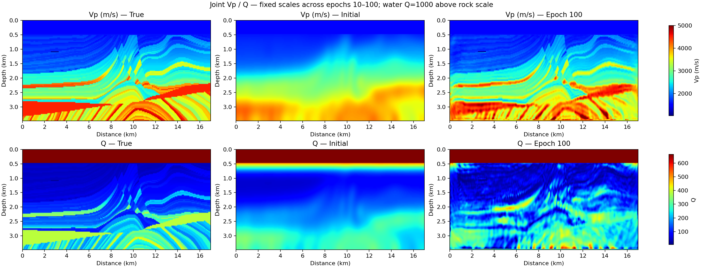
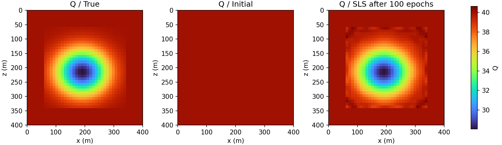
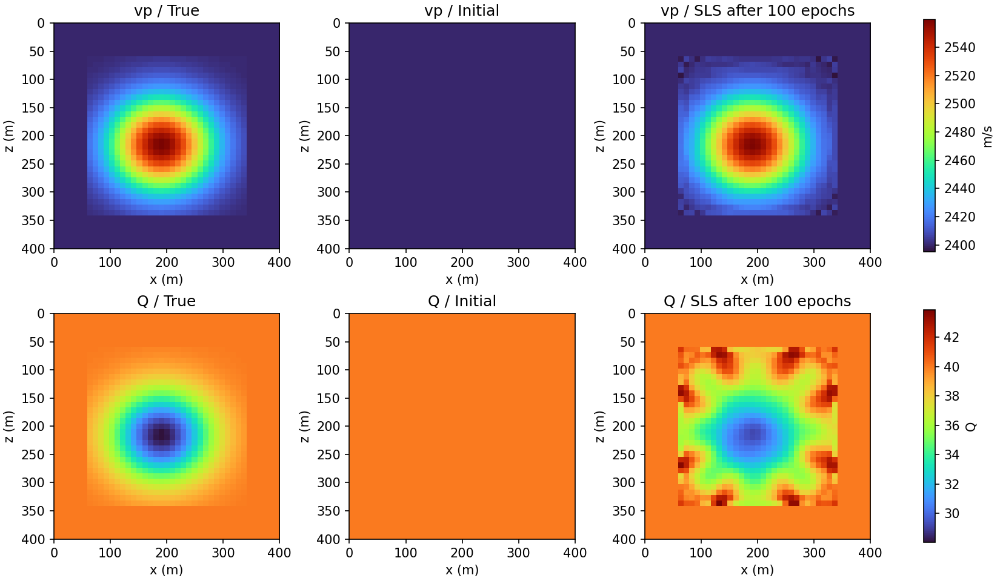
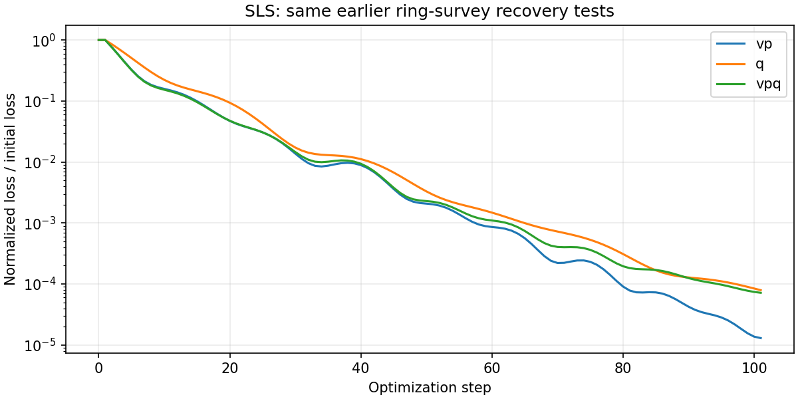

# SLS：Marmousi2 反演

本例比较固定真实 Q 的 Vp 反演与 Vp/Q 联合反演，展示用户于 2026-10-09 保存的两组 **100 轮** CUDA 结果。两组数据失配和 Vp 误差均下降；联合反演的 Q 误差在中途最小，随后回升。因此“训练 loss 下降”和“Q 持续恢复”必须分开判断。

实验使用公开 V14 合入前的独立 SLS 源版本，不将这些结果改标为 7.0.0 wheel 实测。本次手册整理读取已有结果与图件，没有重跑 GPU。原带输出 Notebook 运行的是 **5 轮**小测试；此处 100 轮由配套脚本后台运行，不能混用两者的执行记录。接口约定见 [SLS API](../visco-sls.md)。

(sls-example-setup)=
## 模型、采集与优化设置

| 参数 | 两组 100 轮实验 |
|---|---|
| 模型轴序 / 网格 | `[z,x]`，117 × 567，float32 |
| dz / dx | 30 m / 30 m |
| 方程 / 密度 | 二维 single-SLS；固定常密度 2000 kg/m³ |
| Vp / Q 物理意义 | 6 Hz 处相速度与复体积模量 Q |
| Ricker / 峰值 | 6 Hz / 0.45 s；forcing 单位 Pa/m² |
| dt / nt | 0.0015 s / 4000，无内部重采样 |
| 空间阶数 / PML / memory | 8 / 每侧 10 格 / full |
| 固定 max_vel | 6000 m/s，覆盖非松弛速度 |
| 炮 / 每炮接收道 | 30 / 567，源和接收点均在 z=0 行 |
| 震源横向索引 | 18, 36, …, 540；接收覆盖全部横向网格 |
| 设备 / 外部 batch | 两张 NVIDIA A30；15 个 batch，每卡每批一炮 |
| 初始模型 | 对真值做 Gaussian 平滑，sigma=8 格 |
| 固定区域 | 顶部 16 行水层及最外一圈物理网格 |
| Adam / 学习率 | betas=(0.5,0.99)；Vp=10，联合 Q=0.5 |
| 实验参数约束 | Vp 800–5000 m/s；联合 Q 5–1200 |
| 轮数 / 更新数 | 每组 100 轮；15 次更新/轮，共 1500 次 Adam 更新 |

真实岩石 Q 按本实验设定 `Q=3.516e-6 * Vp[m/s]**2.2` 构造；水层单独固定为 Q=1000。公式出处为[豆辉、张剑锋（2016）§5.3](https://html.rhhz.net/dqwlxb/2016-11-4212.htm)，DOI: 10.6038/cjg20161123。此处仅用来构造合成岩石 Q，不沿用该文的广义常 Q 或非规则网格建模声明；它不是密度经验公式，也不是传播器内部约束。联合反演的 Vp 与 Q 独立优化，不强制在训练中保持该关系。固定 Q 组从头到尾使用真实 Q，因此有比联合组更强的已知信息。

Vp 初值由真实 Vp 平滑获得；联合 Q 初值由真实 Q 平滑获得，再恢复水层真值。固定区域在初始化后不更新，可训练区域为 56,500 / 66,339 个网格点。Q 平滑先包含高 Q 水层再恢复水层真值，因此水层下方的初始岩石 Q 可以高于真实岩石 Q 最大值。这些均属于合成实验条件，不能等同于真实资料中已知的背景模型。

源、接收点在 z=0 行不代表引入自由表面。源间距 540 m，接收间距 30 m；最后采样时刻为 5.9985 s。观测由与反演相同的 SLS 方程生成，没有额外加噪步骤；这是匹配物理模型的理想化合成实验，不是现场 Q 恢复或模型失配稳健性验证。

(sls-example-models)=
## 真值、初值与最终模型


```{raw} html
<figure class="sw-example-figure" id="figure-joint-models-initial">
  <div class="sw-example-viewport" role="region" tabindex="0" aria-label="可横向滚动的科学图像">
    <a href="../_static/sls/figures/joint_models_initial.png" target="_blank" rel="noopener" aria-label="打开原始分辨率图像"></a>
  </div>
  <figcaption>联合反演的真实与初始模型。初值来自真值的 Gaussian 平滑，顶部 16 行水层恢复真值；两者均为实验先验。初始/第 0 轮面板相同；此原始初始图与后面的最终图色标范围不同，跨图比较应读取数值和误差指标。 <a href="../_static/sls/figures/joint_models_initial.png" target="_blank" rel="noopener">打开原始分辨率图像 ↗</a></figcaption>
</figure>
```

```{raw} html
<figure class="sw-example-figure" id="figure-marmousi100-models-comparison">
  <div class="sw-example-viewport" role="region" tabindex="0" aria-label="可横向滚动的科学图像">
    <a href="../_static/sls/figures/marmousi100_models_comparison.png" target="_blank" rel="noopener" aria-label="打开原始分辨率图像"></a>
  </div>
  <figcaption>两种模式在第 100 轮的模型对照。Vp 使用共享 m/s 色标，Q 使用共享无量纲岩石色标；固定水层 Q=1000 超出所显示岩石色标范围。固定 Q 组的 Q 等于真值，是输入条件而非反演结果。 <a href="../_static/sls/figures/marmousi100_models_comparison.png" target="_blank" rel="noopener">打开原始分辨率图像 ↗</a></figcaption>
</figure>
```

(sls-example-metrics)=
## 完整评估与训练曲线

下表是冻结初始或最终模型后、使用完整 30 炮的归一化 MSE 评估；归一化分母为固定的全部观测均方值。优化器实际最小化该归一化目标乘 `1e6`。表中 RMSE 为整个模型相对合成真值的误差，包含固定区域，不是仅可训练区域 RMSE。

| 指标 | 固定真实 Q，反 Vp | 联合 Vp/Q |
|---|---:|---:|
| 初始完整评估归一化 MSE | 0.051367496 | 0.071956527 |
| 最终完整评估归一化 MSE | 0.000436810 | 0.003924164 |
| 初始 Vp RMSE (m/s) | 365.097 | 365.097 |
| 最终 Vp RMSE (m/s) | 191.772 | 206.753 |
| 初始 / 最终 Q RMSE | 固定真值，均为 0 | 99.737 → 82.820 |

仅可训练区域的 Vp RMSE：固定 Q 为 393.076→202.933 m/s，联合为 393.076→219.526 m/s；联合 Q 为 107.707→89.300。它们与表中的全模型口径不同。

训练曲线每一点是该轮各 batch 更新前计算的损失均值，轮内模型持续变化；它不是冻结同一模型后重算的完整炮集目标。尤其联合第 100 轮训练均值约为 0.000950100，而最终完整评估为 0.003924164，不能把两者拼成一条同口径曲线。


```{raw} html
<figure class="sw-example-figure" id="figure-marmousi100-loss-comparison">
  <div class="sw-example-viewport" role="region" tabindex="0" aria-label="可横向滚动的科学图像">
    <a href="../_static/sls/figures/marmousi100_loss_comparison.png" target="_blank" rel="noopener" aria-label="打开原始分辨率图像"></a>
  </div>
  <figcaption>100 轮训练 batch 平均归一化 MSE，纵轴为对数尺度。每批随后进行一次参数更新，两组均降低训练目标，但该曲线不是首末冻结模型的完整评估。 <a href="../_static/sls/figures/marmousi100_loss_comparison.png" target="_blank" rel="noopener">打开原始分辨率图像 ↗</a></figcaption>
</figure>
```


```{raw} html
<figure class="sw-example-figure" id="figure-marmousi100-rmse-comparison">
  <div class="sw-example-viewport" role="region" tabindex="0" aria-label="可横向滚动的科学图像">
    <a href="../_static/sls/figures/marmousi100_rmse_comparison.png" target="_blank" rel="noopener" aria-label="打开原始分辨率图像"></a>
  </div>
  <figcaption>每轮模型对合成真值的全模型 RMSE。Vp 误差两组均下降；联合 Q 在约 60 轮附近达到最低后回升。真值误差只用于评估，没有作为 loss 输入优化器。 <a href="../_static/sls/figures/marmousi100_rmse_comparison.png" target="_blank" rel="noopener">打开原始分辨率图像 ↗</a></figcaption>
</figure>
```

(sls-example-q)=
## 如何理解联合 Q 的后期退化

完整逐轮 history 中，联合 Q 的最低全模型 RMSE 为 **70.131958，出现在第 59 轮**；第 100 轮为 **82.819542**。第 60 轮是邻近的已保存模型 checkpoint，诊断图虚线使用这一位置。后半程训练 loss 继续总体下降，不能据此选择最终 Q 为最佳模型。

真值 RMSE 仅在此合成实验中可用；真实资料无法以未知 Q 的 RMSE 选择停止轮次。

这一现象与 Vp/Q 参数权衡、采集与频带导致的可辨识性限制相容，但仅凭这两条训练轨迹不能证明唯一原因。固定 Q 组具有正确 Q 先验，不能直接把组间差异归结为某一参数、学习率或传播代码错误。改变初值、频带、正则化或优化策略需要新的受控实验；本页不将尚未运行的方案当作改善结果。


```{raw} html
<figure class="sw-example-figure" id="figure-joint-loss-and-model-errors">
  <div class="sw-example-viewport" role="region" tabindex="0" aria-label="可横向滚动的科学图像">
    <a href="../_static/sls/figures/joint_loss_and_model_errors.png" target="_blank" rel="noopener" aria-label="打开原始分辨率图像"></a>
  </div>
  <figcaption>联合反演的训练 loss、Vp RMSE 与 Q RMSE 并列。虚线位于第 60 轮；逐轮数据的精确 Q 最优轮次为 59。后期数据拟合继续改善时，Q 模型误差反而增大。 <a href="../_static/sls/figures/joint_loss_and_model_errors.png" target="_blank" rel="noopener">打开原始分辨率图像 ↗</a></figcaption>
</figure>
```


```{raw} html
<figure class="sw-example-figure" id="figure-joint-Q-all-epochs">
  <div class="sw-example-viewport" role="region" tabindex="0" aria-label="可横向滚动的科学图像">
    <a href="../_static/sls/figures/joint_Q_all_epochs.png" target="_blank" rel="noopener" aria-label="打开原始分辨率图像"></a>
  </div>
  <figcaption>共同色标下的 Q 演化，展示真值、初值及每 10 轮保存模型，并非全部 100 个模型快照。水层 Q=1000 超出岩石色标；共享范围用于比较恢复形态与后期变化。 <a href="../_static/sls/figures/joint_Q_all_epochs.png" target="_blank" rel="noopener">打开原始分辨率图像 ↗</a></figcaption>
</figure>
```


```{raw} html
<figure class="sw-example-figure" id="figure-joint-models-epoch-100">
  <div class="sw-example-viewport" role="region" tabindex="0" aria-label="可横向滚动的科学图像">
    <a href="../_static/sls/figures/joint_models_epoch_100.png" target="_blank" rel="noopener" aria-label="打开原始分辨率图像"></a>
  </div>
  <figcaption>联合模式第 100 轮的真值、初值和最终 Vp/Q。最终模型保留真实反演纹理，不以平滑或单独重设色标掩盖 Q 的恢复误差。 <a href="../_static/sls/figures/joint_models_epoch_100.png" target="_blank" rel="noopener">打开原始分辨率图像 ↗</a></figcaption>
</figure>
```

(sls-example-ring)=
## 环形小模型对照

原结果还包含 RTX 4060 上独立的 41×41、25 Hz 环形采集小模型：固定 Vp 只反 Q，Q RMSE 从 3.099631 降至 0.114001；联合 Vp/Q 时，Vp RMSE 从 41.328411 降至 0.911016 m/s，Q RMSE 从 3.099631 降至 0.993559。它说明该小模型及采集条件下 Q 可以改善，同时显示联合恢复与固定其他参数的难度不同；它不替代 Marmousi2 的可辨识性分析。


```{raw} html
<figure class="sw-example-figure" id="figure-ring-Q-only-models">
  <div class="sw-example-viewport" role="region" tabindex="0" aria-label="可横向滚动的科学图像">
    <a href="../_static/sls/figures/ring_Q_only_models.png" target="_blank" rel="noopener" aria-label="打开原始分辨率图像"></a>
  </div>
  <figcaption>环形采集小模型的固定 Vp、仅 Q 反演，比较真实、初始和最终 Q。该配置与 Marmousi2 的地表采集、模型尺度和参数背景不同。 <a href="../_static/sls/figures/ring_Q_only_models.png" target="_blank" rel="noopener">打开原始分辨率图像 ↗</a></figcaption>
</figure>
```


```{raw} html
<figure class="sw-example-figure" id="figure-ring-joint-models">
  <div class="sw-example-viewport" role="region" tabindex="0" aria-label="可横向滚动的科学图像">
    <a href="../_static/sls/figures/ring_joint_models.png" target="_blank" rel="noopener" aria-label="打开原始分辨率图像"></a>
  </div>
  <figcaption>环形采集的联合 Vp/Q 结果。Vp 与 Q 的中心异常均得到改善，但联合 Q 仍存在局部误差，不能仅凭数据拟合宣布唯一恢复。 <a href="../_static/sls/figures/ring_joint_models.png" target="_blank" rel="noopener">打开原始分辨率图像 ↗</a></figcaption>
</figure>
```


```{raw} html
<figure class="sw-example-figure" id="figure-ring-loss">
  <div class="sw-example-viewport" role="region" tabindex="0" aria-label="可横向滚动的科学图像">
    <a href="../_static/sls/figures/ring_loss.png" target="_blank" rel="noopener" aria-label="打开原始分辨率图像"></a>
  </div>
  <figcaption>环形小模型各模式的 loss 除以该模式自身初始 loss，以相对下降量展示。它不是 Marmousi2 的观测能量归一化 MSE，两种数值不能直接比较。 <a href="../_static/sls/figures/ring_loss.png" target="_blank" rel="noopener">打开原始分辨率图像 ↗</a></figcaption>
</figure>
```

(sls-example-download)=
## 下载与复现

完整公开包约 23.1 MiB，包含两组 100 轮 history、每 10 轮模型、代表轮次梯度、原始模型数据、环形对照、10 张图、实验脚本、结果审阅 Notebook 与四页双语 PDF。模型/结果数组和原实验脚本保留数值与逻辑；摘要中机器路径与运行进程信息已整理。

```{raw} html
<nav class="sw-example-downloads" aria-label="SLS 完整算例下载">
<button type="button" class="sw-button sw-button-primary" data-sw-package-download data-manifest="../_static/sls/downloads/package/package.json" data-status="sls-package-status" data-cancel="sls-package-cancel">下载完整 SLS 算例 ZIP（约 23.1 MiB）</button>
<button type="button" class="sw-button" id="sls-package-cancel" hidden>暂停</button>
</nav>
<p id="sls-package-status" class="sw-example-package-status" role="status" aria-live="polite">在当前浏览器逐块及整包校验 SHA-256，完成后保存为一个标准 ZIP；可暂停并继续。</p>
<noscript><p>JavaScript 已关闭，可使用下方 Python 下载脚本获取并校验同一完整 ZIP。</p></noscript>
<script src="../_static/sls/package-download.js" defer></script>
```

- [Python 下载与校验脚本](../_static/sls/downloads/package/join_package.py)，仅使用 Python 标准库
- [包大小、分卷与 SHA-256 清单](../_static/sls/downloads/package/package.json)
- [SLS_Saved_Results.ipynb](../_static/sls/downloads/SLS_Saved_Results.ipynb)：读取 100 轮保存结果，重新计算 RMSE 和绘图；不启动传播或训练
- [CPU 结果审阅脚本](../_static/sls/downloads/review_saved_results.py)，需配合完整包目录
- [原实验工作流](../_static/sls/downloads/marmousi2_sls_fwi.py)，用于显式从头运行，默认 5 轮
- [完整说明](../_static/sls/downloads/README.txt)、[来源与整理范围](../_static/sls/downloads/provenance.json)、[逐文件哈希](../_static/sls/downloads/PACKAGE_MANIFEST.json)

```{raw} html
<nav class="sw-example-downloads" aria-label="SLS 报告下载">
<a class="sw-button sw-button-primary" href="../_static/sls/downloads/SLS_Example_Report.pdf" download="SLS_Example_Report.pdf">下载双语 PDF 报告</a>
<a class="sw-button" href="../_static/sls/downloads/SLS_Example_Report.pdf" target="_blank" rel="noopener">新窗口打开 PDF ↗</a>
</nav>
```

下载和读取已有结果不需要 StarWave 或 GPU。单独的 Notebook 不是完整数据包；解压后保留相对目录。四页 PDF 是根据已保存结果新整理的双语报告，Notebook 是新的只读结果查看器，都不是重新执行的 100 轮 GPU Notebook。

```bash
python join_package.py
# 解压 StarWave-SLS-Marmousi2-Example.zip，进入同名目录后：
sha256sum -c MANIFEST.sha256
python review_saved_results.py
```

CPU 复核需要 NumPy、Matplotlib；Notebook 还需 Jupyter。公开包没有保存完整观测炮集，因此完整目标数值来自原运行摘要；保存模型的 RMSE 可以独立重算，不能从这些模型数组单独复核全部炮集 MSE。

从头训练需要兼容本页 API 的已安装 StarWave SLS 包、PyTorch、NumPy、SciPy、Matplotlib、CUDA 设备及足够 full 历史内存。脚本也使用配套版本的 SLS 系数辅助函数做时间步诊断，这不是新增公共 API；旧版 wheel 不保证具备它。为避免改变原实验工作流，脚本保留显式 `--source-root` 检查，安装 wheel 后可将其设为已安装 `starwave` 目录的父目录：

```bash
SOURCE_ROOT="$(python -c 'import pathlib, starwave; print(pathlib.Path(starwave.__file__).resolve().parent.parent)')"
python marmousi2_sls_fwi.py --source-root "$SOURCE_ROOT" \
  --data data/mar_big_117_567.bin --out new_fixed_Q \
  --gpu-ids 0 1 --num-batches 15 --epochs 100 --mode vp
python marmousi2_sls_fwi.py --source-root "$SOURCE_ROOT" \
  --data data/mar_big_117_567.bin --out new_joint \
  --gpu-ids 0 1 --num-batches 15 --epochs 100 --mode vpq
```

按实际可见设备修改 GPU 编号，使用新的输出目录；已有实验不会被自动覆盖。以上是供读者选择运行的命令，不是本次文档整理新增的训练结果。数据二进制按 float32、`reshape(567,117).T` 读取；它由保存的 Vp 真值恢复，SHA-256 与原运行记录匹配。不同卡数、运行环境或浮点顺序可能改变优化轨迹，不承诺原硬件耗时或逐位相同结果。


