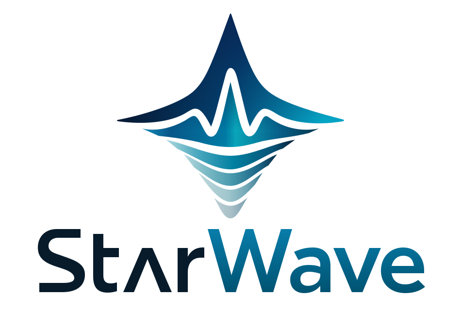

# StarWave 使用手册

```{raw} html
<div class="sw-home-hero">
  <div class="sw-home-intro">
    <p class="sw-home-kicker">可微分波传播 · PyTorch · CUDA</p>
    <h2>波动物理，<br><span>自动微分。</span></h2>
    <p class="sw-home-lead">从一次波场模拟，到一次模型更新。StarWave 将波传播与 PyTorch 的自动微分连接起来，让正演、全波形反演与神经网络模型表示，在同一条计算链路中协同工作。</p>
    <nav class="sw-home-actions" aria-label="开始使用 StarWave">
      <a class="sw-button sw-button-primary" href="installation.html">安装 StarWave <span aria-hidden="true">↗</span></a>
      <a class="sw-button" href="quickstart.html">快速入门 <span aria-hidden="true">→</span></a>
      <a class="sw-home-api-link" href="usage.html">Usage / API <span aria-hidden="true">→</span></a>
    </nav>
  </div>
  <div class="sw-home-identity">
    
    <p>SEE A DEEPER EARTH</p>
  </div>
</div>
```

(home-capabilities)=
## 从物理模型，到可学习的模型

```{raw} html
<div class="sw-home-capabilities">
  <div>
    <svg class="sw-capability-icon" viewBox="0 0 96 64" width="96" height="64" aria-hidden="true" focusable="false"><path d="M10 33h13c5 0 5-18 10-18s7 36 12 36 5-30 10-30 6 12 11 12h20"/><path class="sw-icon-soft" d="M14 46h10m39 0h19M18 56h12m28 0h19"/></svg>
    <h3>用波场，连接模型与观测</h3>
    <p>CUDA 波传播覆盖二维/三维标量声学、二维 VRZ 与二维/三维声学 VTI，为不同介质参数化提供清晰的建模入口。</p>
    <a href="usage.html#propagators">探索传播接口 <span aria-hidden="true">→</span></a>
  </div>
  <div>
    <svg class="sw-capability-icon" viewBox="0 0 96 64" width="96" height="64" aria-hidden="true" focusable="false"><path d="M12 17h56a13 13 0 0 1 0 26H20m10-10L20 43l10 10"/><path class="sw-icon-soft" d="M42 27v7m12-12v12m12-7v7"/><circle cx="12" cy="17" r="4"/></svg>
    <h3>让梯度，参与每一次更新</h3>
    <p>将模拟记录接入 PyTorch 损失函数，经 autograd 回传模型梯度。沿用熟悉的优化器，构建自己的 FWI 实验。</p>
    <a href="modeling/gradient.html">查看梯度实验 <span aria-hidden="true">→</span></a>
  </div>
  <div>
    <svg class="sw-capability-icon" viewBox="0 0 96 64" width="96" height="64" aria-hidden="true" focusable="false"><path class="sw-icon-soft" d="m18 15 27 17-27 17m0-34 27 0 30 17-30 17H18m27-34v34m0-17h30"/><circle cx="18" cy="15" r="5"/><circle cx="18" cy="49" r="5"/><circle cx="45" cy="15" r="5"/><circle cx="45" cy="32" r="5"/><circle cx="45" cy="49" r="5"/><circle cx="75" cy="32" r="7"/></svg>
    <h3>让模型表示，有更多可能</h3>
    <p>模型可以来自网格参数，也可以来自用户定义的隐式神经表示（INR）。通过可微分链路，探索物理与学习的结合。</p>
    <a href="inversion/inr.html">了解 INR 实验接线 <span aria-hidden="true">→</span></a>
  </div>
</div>
```

(home-workflow)=
## 熟悉的 PyTorch，面向波动问题

正演产生记录，损失衡量差异，梯度连接模型。以下片段展示核心接线；完整环境与采集设置见[快速入门](quickstart.md)。

```{raw} html
<div class="sw-home-code">
<p class="sw-home-code-label">模型 → 波传播 → 记录 → 损失 → 梯度</p>
```

```python
import torch
import starwave

predicted = starwave.scalar(
    velocity, grid_spacing=10.0, dt=0.001,
    source_amplitudes=amplitudes,
    source_locations=sources,
    receiver_locations=receivers,
    pml_freq=15.0,
)[0]
loss = torch.nn.functional.mse_loss(predicted, observed)
loss.backward()
```

```{raw} html
</div>
<p class="sw-home-code-note">片段假设原生库已准备就绪，模型、固定采集和观测张量符合接口约定并位于同一 CUDA 设备；velocity 为开启梯度的 float32 模型。INR 页面提供用户网络的概念与接线示例，尚未提供完整收敛验证。</p>
```

(home-start)=
## 从一个小实验开始

```{raw} html
<div class="sw-home-paths">
  <a href="installation.html#installation-smoke"><span class="sw-path-icon"><svg class="sw-tutorial-icon" viewBox="0 0 96 64" width="96" height="64" aria-hidden="true" focusable="false"><rect x="14" y="13" width="66" height="43" rx="5"/><path d="m25 26 9 7-9 7m19 0h14"/><path class="sw-icon-soft" d="M14 21h66"/></svg></span><span class="sw-path-copy"><strong>安装与运行检查</strong><span>准备环境，运行第一个合成炮集。</span></span><span aria-hidden="true">→</span></a>
  <a href="modeling/gradient.html"><span class="sw-path-icon"><svg class="sw-tutorial-icon" viewBox="0 0 96 64" width="96" height="64" aria-hidden="true" focusable="false"><path class="sw-icon-soft" d="M16 53V13m0 40h65"/><path d="m24 43 15-17 15 8 23-19m-13 0h13v13"/></svg></span><span class="sw-path-copy"><strong>计算模型梯度</strong><span>从观测差异，走到模型的更新方向。</span></span><span aria-hidden="true">→</span></a>
  <a href="inversion/fwi.html"><span class="sw-path-icon"><svg class="sw-tutorial-icon" viewBox="0 0 96 64" width="96" height="64" aria-hidden="true" focusable="false"><path d="M23 22a24 24 0 0 1 43-1m0 0V10m0 11H55M70 44a24 24 0 0 1-43 1m0 0v11m0-11h11"/><path class="sw-icon-soft" d="M37 33h7l4-10 5 20 4-10h7"/></svg></span><span class="sw-path-copy"><strong>尝试全波形反演</strong><span>将正演、目标函数与优化器连接起来。</span></span><span aria-hidden="true">→</span></a>
</div>
<div class="sw-home-next"><p>从小模型开始，把你的想法带入下一次反演实验。</p><a href="quickstart.html">打开快速入门 →</a><a href="wsl.html">Windows / WSL →</a><a href="status.html">文档与验证范围 →</a></div>
```

```{toctree}
:maxdepth: 1
:hidden:
:caption: 开始使用

关于 StarWave <about>
演示文稿 <presentation>
安装 <installation>
Docker <docker>
WSL <wsl>
快速入门 <quickstart>
```

```{toctree}
:maxdepth: 1
:hidden:
:caption: 正演模拟

基本约定 <modeling/conventions>
观测系统 <modeling/acquisition>
标量声学 <modeling/scalar>
梯度 <modeling/gradient>
波传播 <modeling/wave-propagation>
波场反传重建 <modeling/reconstruction>
```

```{toctree}
:maxdepth: 1
:hidden:
:caption: 反演

FWI <inversion/fwi>
DataParallel <inversion/dataparallel>
INR <inversion/inr>
```

```{toctree}
:maxdepth: 1
:hidden:
:caption: Example

Scalar3D <examples/index>
六面包围异常体 <examples/enclosed>
地表采集异常体 <examples/surface>
起伏薄层模型 <examples/layered>
下载与复现 <examples/reproduce>
```

```{toctree}
:maxdepth: 1
:hidden:
:caption: Usage

Usage <usage>
```

```{toctree}
:maxdepth: 1
:hidden:
:caption: 参考

常见问题 <faq>
更新日志 <release-notes>
文档状态 <status>
```
