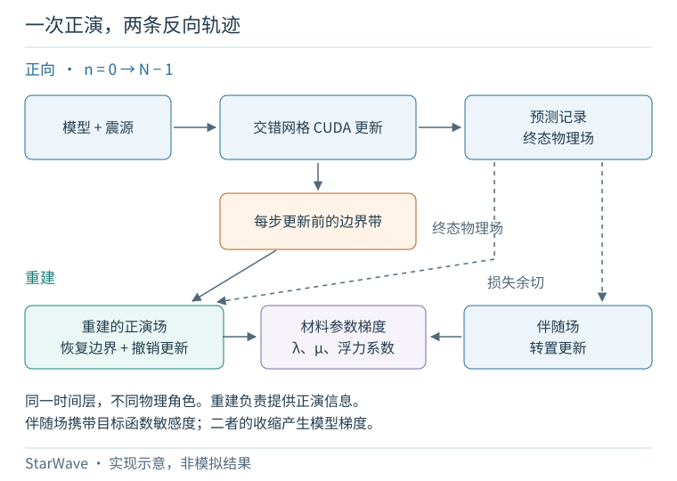
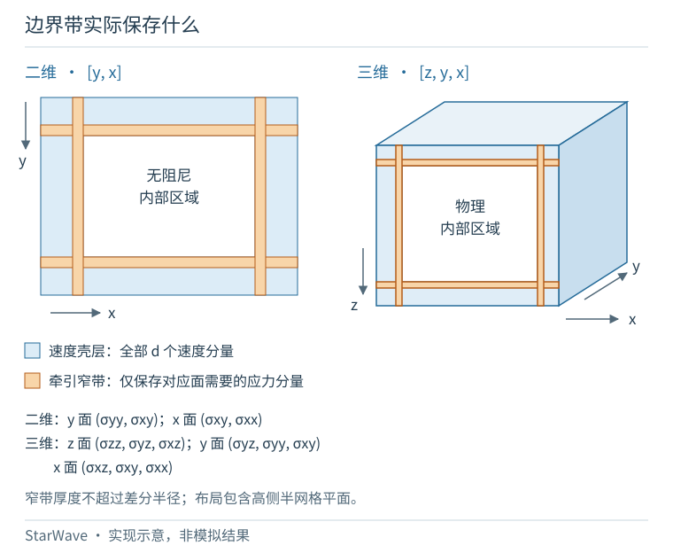
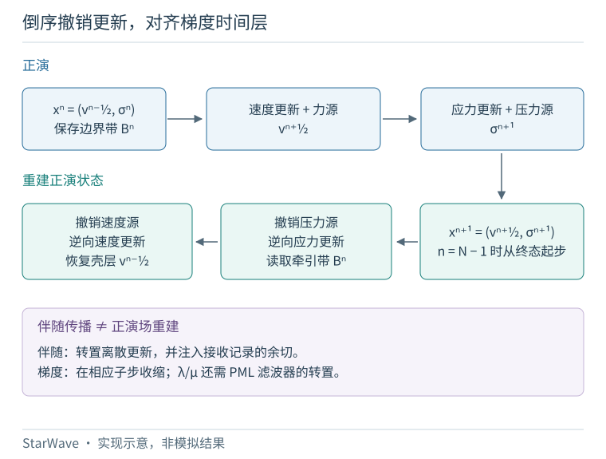
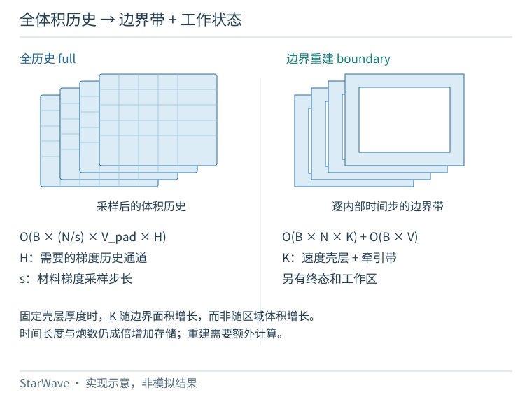

(reconstruction)=
# 波场反传重建

StarWave 弹性传播的 `memory="boundary"` 模式，在损失梯度反向传播时逐步重建正演物理场，用**边界带与终态物理场**替代按时间保存的全体积材料导数历史。本章解释 4.0.0 源码契约中的原生二维／三维方法。参数与调用示例见 {ref}`Elastic Function <elastic>` 及其{ref}`内存选项 <elastic-memory>`。

**正演场重建与伴随传播承担不同任务。** 重建恢复较早时刻的正演值；伴随场携带损失对这些值的敏感度。二者在对应时间层相遇，累加模型梯度。它们都不能简单理解为把接收记录倒放。

```{raw} html
<figure class="sw-reconstruction-figure">
  <div class="sw-reconstruction-scroll" role="region" tabindex="0" aria-label="可横向滚动的示意图">
    
  </div>
  <figcaption>图 1．原生边界方法的数据流。保存的正演信息用于重建，记录或终态输出的损失余切驱动伴随场。两条轨迹都沿时间索引递减的方向推进，但场变量与作用各不相同。</figcaption>
</figure>
```

(reconstruction-state)=
## 交错网格上的弹性状态

各向同性弹性介质内部的速度与应力满足下式。其中 {math}`\beta=1/\rho` 为浮力系数，{math}`\lambda,\mu` 为 Lamé 参数，{math}`f_i` 为体力源，{math}`p` 采用 API 的压力源符号约定：

```{math}
\partial_t v_i=\beta\sum_j\partial_j\sigma_{ij}+\beta f_i,
\qquad
\partial_t\sigma_{ij}
=\lambda\delta_{ij}\nabla\!\cdot v
+\mu(\partial_i v_j+\partial_j v_i)-p\delta_{ij}.
```

StarWave 的空间网格与时间更新均采用交错形式。记步前物理状态为 {math}`x^n=(v^{n-1/2},\sigma^n)`，完整正演状态 {math}`X^n` 还包含 PML 记忆变量。二维有 5 个物理场，三维有 9 个；完整状态分别有 13 和 27 个场。API 轴序分别为 `[y,x]` 和 `[z,y,x]`。

设内部时间步长为 {math}`\Delta t`，交错浮力系数为 {math}`B_i`，离散散度为 {math}`D_\sigma`，本构更新为 {math}`C D_v`，则**无阻尼内部区域**的一步更新可写为

```{math}
\begin{aligned}
v^{n+1/2}&=v^{n-1/2}+\Delta t\,B D_\sigma\sigma^n+s_v^n,\\
\sigma^{n+1}&=\sigma^n+\Delta t\,C D_vv^{n+1/2}+s_\sigma^n.
\end{aligned}
```

前端完成时间重采样后的源增量为 {math}`s_{v_i}^n=\Delta t B_i f_i^n` 与 {math}`s_\sigma^n=-\Delta t p^n I`。先更新速度，再更新应力；接收采样与边界记录均在这对更新**之前**完成。因此，半时间步约定会直接影响撤销震源与梯度对齐。吸收边界附近使用 PML 修正导数；重建并不假设耗散的 PML 更新可以稳定求逆。

(reconstruction-tape)=
## 保存差分模板真正需要的边界信息

每个实际传播的内部时间步，StarWave 从步前状态打包 {math}`\mathcal B^n`：

- PML 各方向厚层并集上的全部速度分量，并计入高侧有效半网格平面；棱、角交叠位置只保存一次。
- 按方向保存的窄牵引带，厚度不超过差分半径 {math}`r=\mathrm{accuracy}/2`。法向为 {math}`a` 的面需要应力分量 {math}`\sigma_{ia}`。

StarWave 另外只保留**一份**用于启动倒序轨迹的终态物理场 {math}`x^N`，与逐时间步的边界带分开存放。

```{raw} html
<figure class="sw-reconstruction-figure">
  <div class="sw-reconstruction-scroll" role="region" tabindex="0" aria-label="可横向滚动的示意图">
    
  </div>
  <figcaption>图 2．保存的物理信息及其几何位置。蓝色表示速度壳层，橙色表示窄牵引带；三维剖视仅示意内部区域。实际带宽及高侧半网格平面由离散布局决定，不按图中比例计算。</figcaption>
</figure>
```

二维 y 法向带保存 `sigmayy, sigmaxy`，x 法向带保存 `sigmaxy, sigmaxx`；三维 z、y、x 法向带各保存相应的三个牵引分量。牵引块彼此独立，交叠处的剪应力值可能重复。这是由差分模板决定的布局，不能概括为任何阶数都只需一层边界。

二维和三维均采用上述速度／牵引带。它**不是 PML 记忆变量的逐时间历史**，也不保存吸收区内全部应力的完整历史。终态 PML 场仍属于公开返回值，初始 PML 状态仍作为输入保留，其伴随量也参与反向计算。具体打包公式见固定版本的[布局与分配代码](https://github.com/StarrMoonn/StarWave/blob/17fc161363b60879a94029d0af2d3f97f23879de/starwave/_deepwave/boundary_loop.py#L95-L115)。

(reconstruction-reverse)=
## 按更新的逆序恢复正演场

从 {math}`x^{n+1}` 出发，一个重建步依次完成：

1. 从法向应力中减去该步压力源增量。
2. 用 {math}`v^{n+1/2}` 撤销无阻尼内部的应力更新，并恢复记录的 {math}`\sigma^n` 牵引窄带。
3. 从速度中减去该步体力源增量。
4. 用恢复后的 {math}`\sigma^n` 撤销内部速度更新，并把 PML 壳层速度替换为记录的 {math}`v^{n-1/2}`。

对无阻尼内部，这对应代数逆序

```{math}
\begin{aligned}
\sigma^n&=\sigma^{n+1}-s_\sigma^n-\Delta t\,C D_vv^{n+1/2},\\
v^{n-1/2}&=v^{n+1/2}-s_v^n-\Delta t\,B D_\sigma\sigma^n.
\end{aligned}
```

应力重建使用的 {math}`v^{n+1/2}` 必须仍包含体力源。提前撤销速度源会恢复出不同的正演轨迹。边界回填则补齐外侧差分模板需要的值，避免把吸收过程直接倒转。

```{raw} html
<figure class="sw-reconstruction-figure">
  <div class="sw-reconstruction-scroll" role="region" tabindex="0" aria-label="可横向滚动的示意图">
    
  </div>
  <figcaption>图 3．一个交错时间步及其物理场重建。下行从右向左读取；应力更新撤销之前，速度中必须保留体力源贡献。实际内核将伴随子步和梯度收缩交错执行。</figcaption>
</figure>
```

内核恢复内部应力、所需牵引窄带及需要的速度场，有意不恢复整个外侧 PML 的全部应力。浮点减法也未必能逐位撤销浮点加法。稳定的正演、相同的源与初态约定、相同几何和系数，以及一致的边界带都是必要条件；长时间轨迹、强材料反差应按实际使用精度单独验证。这一构造并不是任意耗散波动求解器的通用逆算子。

(reconstruction-gradient)=
## 与离散伴随和材料梯度耦合

令 {math}`X^{n+1}=F_n(X^n,m)` 表示完整离散正演步，{math}`r^n` 为接收数据余切，伴随递推为

```{math}
\bar X^n=(\partial_XF_n)^T\bar X^{n+1}+R^T r^n.
```

这是**雅可比转置的作用**，并非 {math}`F_n^{-1}\bar X^{n+1}`。StarWave 将重建物理场与伴随场存放在独立缓冲区中；CUDA 反向循环交错执行重建、源梯度提取、材料梯度累加与转置更新。由于接收值在正演步开始时采样，接收余切在对应反向步末尾注入。

在无阻尼内部，材料梯度包含以下按对应子步对齐的收缩：

```{math}
\begin{aligned}
g_\lambda &\mathrel{+}=\kappa_n\Delta t
\Big(\sum_i\bar\sigma_{ii}\Big)\Big(\sum_i D_i v_i\Big),\\
g_{\mu,\mathrm{normal}} &\mathrel{+}=2\kappa_n\Delta t\sum_i\bar\sigma_{ii}D_i v_i,\\
g_{\mu_{ij}} &\mathrel{+}=\kappa_n\Delta t\,\bar\sigma_{ij}(D_i v_j+D_j v_i),\quad i<j,\\
g_{B_i}&\mathrel{+}=\kappa_n\bar v_i\,\Delta v_i/B_i.
\end{aligned}
```

其中 {math}`\Delta v_i=v_i^{n+1/2}-s_{v_i}^n-v_i^{n-1/2}` 已去掉体力源增量。PML 壳层中的两个速度值可由重建与边界带取得，因此浮力梯度不需要 PML 应力历史；这也要求请求浮力梯度时，有效交错 {math}`B_i` 非零。体力源本身对浮力的依赖，另由源预处理的求导链传回。

Lamé 梯度还必须计入 PML 导数滤波。某个方向的递推为 {math}`m^{n+1}=a m^n+b d^n`，修正导数为 {math}`d^n+m^{n+1}`。对 {math}`G=\sum_n w_n(d^n+m^{n+1})`，初始化 {math}`G=0`、{math}`R=0`，再倒序遍历：

```{math}
G\mathrel{+}=[(1+b)w_n+bR]d^n,\qquad
R\leftarrow a(w_n+R),\qquad
G\mathrel{+}=R m^0\ \text{after the loop}.
```

最后一项在循环结束后加入。权重 {math}`w_n` 包含采样后的对应应力余切；时间步长和本构系数按前述收缩计入。这里的 {math}`\kappa_n` 是梯度采样权重，不是 PML 拉伸系数。

这是因果时间滤波器的转置：只乘阻尼系数，不除以阻尼系数，并保留非零初始 PML 记忆的贡献。[二维](https://github.com/StarrMoonn/StarWave/blob/17fc161363b60879a94029d0af2d3f97f23879de/starwave/_deepwave/boundary_loop.h#L94-L102)和[三维](https://github.com/StarrMoonn/StarWave/blob/17fc161363b60879a94029d0af2d3f97f23879de/starwave/_deepwave/boundary_loop_3d.h#L59-L73)内核将这一步与材料梯度计算共同完成。

前端继续对空间材料平均、测区提取、复制填充与时间重采样求导。经过这条完整链后，{ref}`公开材料转换 <elastic-conversions>`再把原始输入的梯度映射到速度与密度。该函数实际使用正则化浮力 {math}`\beta=\rho/(\rho^2+\epsilon)`，因此

```{math}
\begin{aligned}
g_{v_p}&=2\rho v_p g_\lambda,\\
g_{v_s}&=2\rho v_s(g_\mu-2g_\lambda),\\
g_\rho&=(v_p^2-2v_s^2)g_\lambda+v_s^2g_\mu
+\frac{\epsilon-\rho^2}{(\rho^2+\epsilon)^2}g_\beta.
\end{aligned}
```

这里的梯度已包含完整参数化链，不能用手工截取的应力相关项替代。常见的密度项 {math}`-g_\beta/\rho^2` 仅是未正则化的极限。

(reconstruction-memory)=
## 内存随边界面积与时间增长

设维数为 {math}`d`，炮数为 {math}`B`，实际传播的内部步数为 {math}`N`，每个元素占 {math}`e` 字节。{math}`L_a` 包含 PML，但不包含差分 halo。定义低侧、高侧保存宽度及格点数：

```{math}
\begin{gathered}
\ell_a=p_{a,-},\qquad h_a=p_{a,+}+\mathbf1[p_{a,+}>0],\qquad V=\prod_a L_a,\\
N_v=V-\prod_a(L_a-\ell_a-h_a),\\
T_a=[\min(\ell_a,r)+\min(h_a,r)]\prod_{b\ne a}L_b,\\
K=d\Big(N_v+\sum_aT_a\Big).
\end{gathered}
```

请求至少一种材料参数梯度时，重建数据本身的精确存储量为

```{math}
M_\mathrm{tape}=eBNK,\qquad
M_\mathrm{terminal}=eBV\,\frac{d(d+3)}2.
```

仅对源／初态求导时不需要时间带；所有 PML 宽度均为零时，{math}`K=0`。这些情形仍需其余状态和工作区。

终态种子即二维的 5 个物理场或三维的 9 个物理场。固定 PML 宽度与差分阶数时，{math}`K` 在二维按周长、三维按表面积增长；边界时间带仍随传播时长和炮数线性增长。因此，大规模三维的边界带依然可能占用大量显存。

```{raw} html
<figure class="sw-reconstruction-figure">
  <div class="sw-reconstruction-scroll" role="region" tabindex="0" aria-label="可横向滚动的示意图">
    
  </div>
  <figcaption>图 4．存储结构示意，不是实测显存或性能柱状图。full 保存按需选择并采样的导数历史；boundary 将时间乘体积的存储项改为时间乘边界，并保留体积级状态与工作区。它不会消除时间依赖或 GPU 工作显存。</figcaption>
</figure>
```

实际 `full` 模式保存的是**按需要选择的材料导数体积历史**，并非完整正演状态中的每个场。若材料梯度采样步长为 {math}`s`，其历史数量正比于 {math}`BNV_\mathrm{padded}H/s`，其中

```{math}
H=d\,\mathbf1[\lambda\text{ or }\mu]
+\frac{d(d-1)}2\,\mathbf1[\mu]
+d\,\mathbf1[\beta].
```

示性函数表示是否请求该参数梯度，二维最多 5 个通道、三维最多 9 个通道。在小区域、厚 PML 或较大时间采样间隔下，边界模式未必更省显存。

上述公式均不是 GPU 峰值显存。模型与自动微分图、初态、源／接收数组、输出余切、梯度、终态副本和工作场仍需空间，伴随状态也有自身的 PML 记忆。Lamé 时间滤波的辅助数组在二维为固定数量的体积场，在三维为按方向的厚层数组。重建还增加逆向差分计算与边界带读写，不能据此承诺普遍加速。CPU／磁盘卸载和压缩处理的是不同的存储成本，当前边界路径不启用这些方式。

(reconstruction-scope)=
## 支持范围与数值验证

- **原生执行：** CUDA 二维／三维、`float32`／`float64`、精度阶数 2／4／6／8，`storage_mode="device"`、无压缩、`python_backend=False`。每个物理方向的尺寸必须大于两倍差分半径。详见 {ref}`API 限制 <elastic-notes>`。
- **时间采样：** CFL 子步倍率为 {math}`q` 时，记 `model_gradient_sampling_interval` 为 {math}`I`，材料梯度步长为 {math}`s=qI`，权重为 {math}`\kappa_n=s\mathbf1[n\bmod s=0]`。边界记录、状态／源伴随与 PML 时间滤波仍按每个实际内部步推进。与原生 `full` 对齐，指遵循同一套采样材料梯度约定；当 {math}`s>1` 时，不能据此声称等同于全部内部步的材料自动微分。
- **时间尾部：** 当前路径推进完整步长分组，即 {math}`N=\lfloor N_\mathrm{requested}/s\rfloor s`，余下内部接收行先补零，再进入前端降采样。没有完整分组的边界情况不是受支持的空操作，不应依赖它。
- **表面与求导：** 弹性 API 没有通用 `free_surface` 开关；某侧 PML 设为零本身不等于无牵引自由表面。密度求导还要求有效交错浮力非零。原生高阶导数不受支持；正演回调是只读观察器，边界模式不支持反向回调。

源码测试定义了 full／boundary 对比、多阶数与多精度、非对称／零 PML、体力源与压力源、CFL 子步、非零物理／PML 初态、共享／逐炮模型和长轨迹测试。测试文件的存在是**验证规范**，不是每个 GPU 或公开 wheel 已通过所有案例的证据。源版本发布记录的是 CPU／静态检查，并明确未重新执行 CUDA 数值等价验收。本次文档更新没有运行 GPU 实验，详见[文档状态](../status.md)。

对于新任务，先在完全相同设置下比较 `full` 与 `boundary` 的接收记录、终态输出，以及每个请求的模型／源／初态梯度。同时检查相对误差和绝对误差，尤其留意参考梯度接近零的情况。方向导数检查需要一致的采样约定；先验证未对材料梯度降采样的情形，再评估采样近似。长时间稳定性与实测峰值显存应分别检查。代数可逆不构成逐位相同、跨精度稳定或反演收敛的普遍保证。

(reconstruction-references)=
## 理论与实现参考

边界保存已有成熟的研究背景。下列论文提供理论脉络，固定版本的源码链接则界定本章描述的 StarWave 存储布局与更新顺序。这不意味着其它论文的具体公式、最小存储证明或数值验收可以原样移用于本实现。

1. Yang, P., Gao, J. and Wang, B.（2014）. [RTM using effective boundary saving: A staggered grid GPU implementation](https://doi.org/10.1016/j.cageo.2014.04.004). *Computers & Geosciences*, 68, 64–72。关于差分模板相关的边界存储与 CPML；另见[作者提供的可复现全文](https://ahay.org/RSF/book/xjtu/gpurtm/paper_html/)。
2. Aaker, O. E. 等（2020）. [Wavefield reconstruction for velocity–stress elastodynamic full-waveform inversion](https://doi.org/10.1093/gji/ggaa147). *Geophysical Journal International*, 222, 595–609。关于弹性正演场重建及其在梯度计算中的作用。
3. StarWave 源码契约，提交 `17fc161`：[二维反向循环](https://github.com/StarrMoonn/StarWave/blob/17fc161363b60879a94029d0af2d3f97f23879de/starwave/_deepwave/boundary_loop.h#L251-L377)、[三维反向循环](https://github.com/StarrMoonn/StarWave/blob/17fc161363b60879a94029d0af2d3f97f23879de/starwave/_deepwave/boundary_loop_3d.h#L264-L367)、[分配与条件检查](https://github.com/StarrMoonn/StarWave/blob/17fc161363b60879a94029d0af2d3f97f23879de/starwave/_deepwave/boundary.py#L131-L218)、[材料转换公式](https://github.com/StarrMoonn/StarWave/blob/17fc161363b60879a94029d0af2d3f97f23879de/starwave/_deepwave/common.py#L2515-L2542)。
4. 验证边界：[数值对比测试](https://github.com/StarrMoonn/StarWave/blob/17fc161363b60879a94029d0af2d3f97f23879de/tests/test_deepwave_boundary_cuda.py)、[采样约定回归测试](https://github.com/StarrMoonn/StarWave/blob/17fc161363b60879a94029d0af2d3f97f23879de/tests/test_deepwave_api27.py#L384-L399)、[源版本发布验证记录](https://github.com/StarrMoonn/StarWave/blob/17fc161363b60879a94029d0af2d3f97f23879de/docs/releases/v11/V11_RELEASE_NOTES.md#executed-validation-and-limits)。
